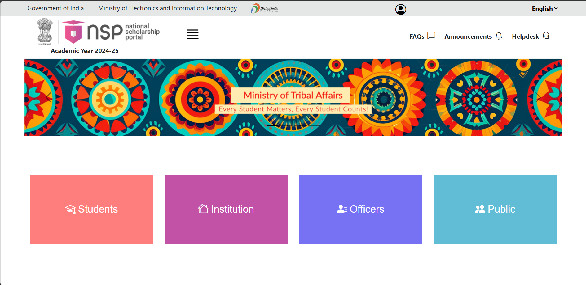

<<<<<<< HEAD
# 🏛️ National Scholarship Portal

A web-based platform that enables students to apply for various government scholarships online. Built using the MERN stack (MongoDB, Express, React, Node.js), this project simulates the official National Scholarship Portal in a simplified and educational format.


---

## 📸 Demo



[🔗 Live Demo](https://national-scholarship-portal.netlify.app/)

---

## 📌 Features

- 🎓 Student registration and login
- 📝 Scholarship application submission
- 🔍 Track application status
- 🧑‍💼 Admin panel for approval/rejection
- 📄 Upload and manage documents
- 📬 Email notification for status updates

---

## 🛠️ Tech Stack

**Frontend**:  
`Html` `Css ` `Bootstrap`  
  

---

## 🚀 Installation

### 📦 Clone the Repository

```bash
git clone https://github.com/your-username/national-scholarship-portal.git
cd national-scholarship-portal
=======
https://national-scholarship-portal.netlify.app/
>>>>>>> 268fc36a63e3c0adb3003f5c2e2ed1e9c49d683f
